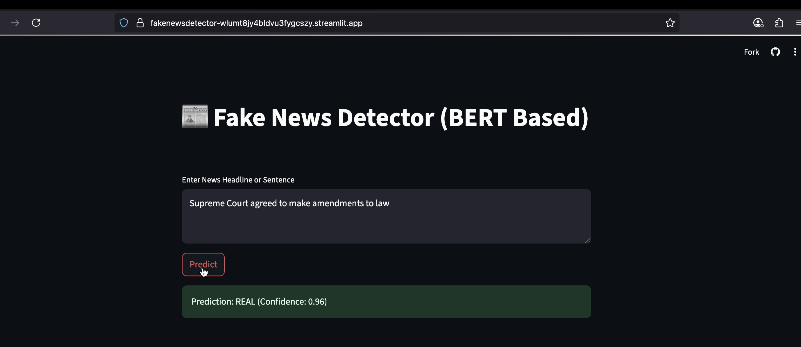

# 📰 Fake News Detector using BERT

This project is a **deep learning-based web application** that detects whether a news headline is _Fake_ or _Real_, using a fine-tuned [BERT (Bidirectional Encoder Representations from Transformers)](https://huggingface.co/bert-base-uncased) model.

Built with **PyTorch**, **Hugging Face Transformers**, and **Streamlit**, the app is deployed on [Hugging Face Spaces](https://huggingface.co/spaces).

---

## 🚀 Demo

👉 [Live Demo on Streamlit cloud](https://fakenewsdetector-wlumt8jy4bldvu3fygcszy.streamlit.app/)

 <!-- Optional -->

---

## 👷🏻‍♂️ Usage

1. either use web
1. clone this repo
1. run pip install -r requirements.txt
1. run download_model.py
1. CLI : run python main.py
1. or streamlit run app.py

## 📌 Features

-   🔍 Input any news headline and get a prediction
-   ⚡ Powered by BERT for contextual understanding
-   📊 Confidence score with classification

---

## 📁 Dataset

-   Source: [Kaggle - Fake and Real News Dataset](https://www.kaggle.com/clmentbisaillon/fake-and-real-news-dataset)
-   Structure: Two CSVs (`Fake.csv`, `True.csv`)
-   Preprocessing:
    -   Merged and labeled
    -   Only `title` used
    -   Train/Val/Test split: **70/15/15**

---

## 🧠 Model Architecture

```python


class BERT_Arch(nn.Module):
    def __init__(self, bert):
        super(BERT_Arch, self).__init__()
        self.bert = bert
        self.dropout = nn.Dropout(0.1)
        self.relu = nn.ReLU()
        self.fc1 = nn.Linear(768, 512)
        self.fc2 = nn.Linear(512, 2)
        self.softmax = nn.LogSoftmax(dim=1)

    def forward(self, sent_id, mask):
        cls_hs = self.bert(sent_id, attention_mask=mask)['pooler_output']
        x = self.fc1(cls_hs)
        x = self.relu(x)
        x = self.dropout(x)
        x = self.fc2(x)
        x = self.softmax(x)
        return x

```
